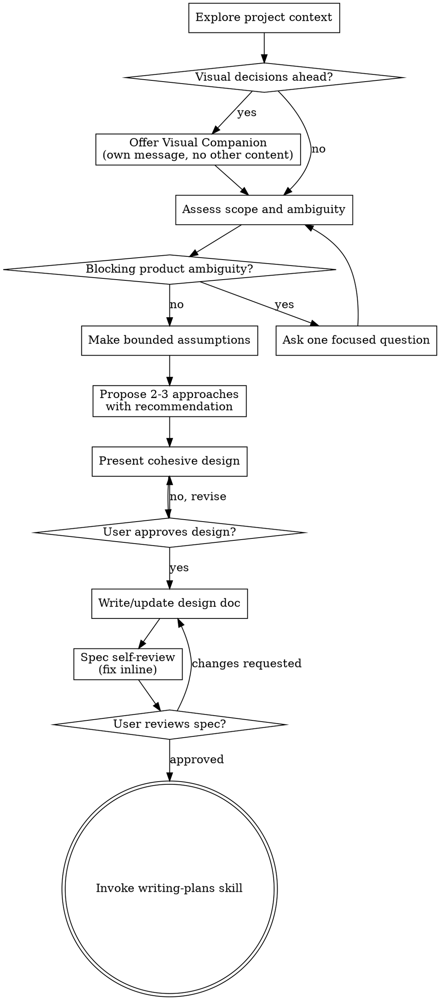

# Brainstorming Ideas Into Designs

Help turn ideas into fully formed designs and specs through natural collaborative dialogue. Be proactive and autonomous: gather context first, identify what can be safely inferred, make bounded assumptions, propose concrete options with a recommendation, and continue producing design/spec artifacts where safe. Ask the user only when there is true product ambiguity you cannot responsibly assume away, or when an explicit approval gate requires their decision.

Start by understanding the current project context, then refine the idea with the minimum necessary interruption. Once you understand what you're building, present a design with evidence, assumptions, and trade-offs, then get the user's approval before any implementation planning or implementation work.

<HARD-GATE>
Do NOT invoke any implementation skill, write any code, scaffold any project, or take any implementation action until you have presented a design and the user has approved it. This applies to EVERY project regardless of perceived simplicity.
</HARD-GATE>

## Anti-Pattern: "This Is Too Simple To Need A Design"

Every project goes through this process. A todo list, a single-function utility, a config change — all of them. "Simple" projects are where unexamined assumptions cause the most wasted work. The design can be short (a few sentences for truly simple projects), but you MUST present it and get approval before implementation planning or implementation work.

## Autonomy Standard

Operate as a design partner, not an interview script.

- **Gather context before asking:** inspect relevant files, docs, existing specs, tests, recent commits, and project conventions before deciding what you need from the user.
- **Separate blockers from preferences:** ask only about decisions that materially change the product direction, user experience, data model, risk posture, or implementation scope. Treat wording, naming, UI polish, and common defaults as assumptions unless the user says they matter.
- **Make bounded assumptions:** when a detail is missing but the likely answer is low-risk, choose a sensible default, label it as an assumption, and keep moving. Prefer reversible assumptions.
- **Recommend, don't just list:** propose 2-3 viable approaches when meaningful, lead with your recommendation, and explain why it best fits the context.
- **Continue to artifacts where safe:** if the user asked for a design/spec or the remaining unknowns are non-blocking, produce or update the design/spec rather than waiting on preferences.
- **Preserve approval gates:** still pause for explicit user approval before implementation planning and before transitioning past a written spec when this skill requires review.

## Checklist

You MUST create a task for each of these items and complete them in order:

1. **Explore project context** — check files, docs, existing specs, tests, recent commits, and conventions relevant to the idea
2. **Offer visual companion** (if upcoming decisions would benefit from visuals) — this is its own message, not combined with a clarifying question. See the Visual Companion section below.
3. **Assess scope and ambiguity** — decompose oversized requests; distinguish true product ambiguity from assumable details
4. **Resolve only blocking questions** — ask one focused question only when the answer materially changes the product/design and cannot be safely assumed
5. **Propose 2-3 approaches** — include trade-offs, your recommendation, and any bounded assumptions you are making
6. **Present design** — cohesive design scaled to complexity, with evidence, assumptions, risks, and validation strategy; request one explicit design approval before implementation planning
7. **Write design doc** — after design approval, or when the user explicitly requested a spec/design artifact and no approval gate is pending, save to `docs/superpowers/specs/YYYY-MM-DD-<topic>-design.md` and commit
8. **Spec self-review** — quick inline check for placeholders, contradictions, ambiguity, scope, and unsupported assumptions (see below)
9. **User reviews written spec** — ask user to review the spec file before proceeding to implementation planning
10. **Transition to implementation planning** — invoke writing-plans skill only after the written spec review gate is satisfied

## Process Flow

**The terminal state is invoking writing-plans.** Do NOT invoke frontend-design, mcp-builder, or any other implementation skill. The ONLY skill you invoke after brainstorming is writing-plans.

## The Process

**Understanding the idea:**

- Check out the current project state first (files, docs, existing specs, tests, recent commits)
- Before asking detailed questions, assess scope: if the request describes multiple independent subsystems (e.g., "build a platform with chat, file storage, billing, and analytics"), flag this immediately. Don't spend questions refining details of a project that needs to be decomposed first.
- If the project is too large for a single spec, help the user decompose into sub-projects: what are the independent pieces, how do they relate, what order should they be built? Then brainstorm the first sub-project through the normal design flow. Each sub-project gets its own spec → plan → implementation cycle.
- For appropriately-scoped projects, infer what you can from context and ask only for blocking product decisions. Use one focused question at a time when a question is necessary.
- Prefer multiple choice questions when possible, but open-ended is fine when the user needs to define product intent.
- Focus on understanding: purpose, constraints, success criteria, users, non-goals, and approval gates.
- If you proceed with assumptions, state them clearly and make them easy for the user to correct.

**Exploring approaches:**

- Propose 2-3 different approaches with trade-offs when there is a meaningful design choice. If the solution space is obvious, briefly explain why and still state the chosen approach.
- Present options conversationally with your recommendation and reasoning.
- Lead with your recommended option and explain why.
- Identify what evidence from the project context supports the recommendation.

**Presenting the design:**

- Once you believe you understand what you're building, present the design as one cohesive review package rather than pausing after every section.
- Scale the design to its complexity: a few sentences if straightforward, up to 200-300 words per nuanced section if needed.
- Cover the parts that matter for this project: architecture, components, data flow, user experience, error handling, testing, rollout, and non-goals. Omit irrelevant sections rather than filling boilerplate.
- Include an **Evidence** section listing the files, docs, specs, tests, or commits that shaped the design.
- Include an **Assumptions** section for bounded assumptions you made without asking.
- Include an **Open Questions / Approval Needed** section only for true product ambiguity or explicit approval gates.
- Ask for one explicit design approval before writing an implementation plan or invoking writing-plans.
- Be ready to revise if something doesn't make sense.

**Design for isolation and clarity:**

- Break the system into smaller units that each have one clear purpose, communicate through well-defined interfaces, and can be understood and tested independently.
- For each unit, you should be able to answer: what does it do, how do you use it, and what does it depend on?
- Can someone understand what a unit does without reading its internals? Can you change the internals without breaking consumers? If not, the boundaries need work.
- Smaller, well-bounded units are also easier for you to work with - you reason better about code you can hold in context at once, and your edits are more reliable when files are focused. When a file grows large, that's often a signal that it's doing too much.

**Working in existing codebases:**

- Explore the current structure before proposing changes. Follow existing patterns.
- Where existing code has problems that affect the work (e.g., a file that's grown too large, unclear boundaries, tangled responsibilities), include targeted improvements as part of the design - the way a good developer improves code they're working in.
- Don't propose unrelated refactoring. Stay focused on what serves the current goal.

## After the Design

**Documentation:**

- Write the validated design (spec) to `docs/superpowers/specs/YYYY-MM-DD-<topic>-design.md`
  - (User preferences for spec location override this default)
- Use elements-of-style:writing-clearly-and-concisely skill if available
- Commit the design document to git
- When the user explicitly asked for a spec/design artifact and no implementation gate is being crossed, do not wait on non-blocking preferences; document the assumptions and continue.

**Spec Self-Review:**
After writing the spec document, look at it with fresh eyes:

1. **Placeholder scan:** Any "TBD", "TODO", incomplete sections, or vague requirements? Fix them.
2. **Internal consistency:** Do any sections contradict each other? Does the architecture match the feature descriptions?
3. **Scope check:** Is this focused enough for a single implementation plan, or does it need decomposition?
4. **Ambiguity check:** Could any requirement be interpreted two different ways? If so, either choose a bounded assumption and make it explicit, or ask only if it is true product ambiguity.
5. **Evidence check:** Does the spec say what context informed it and which assumptions remain? Add concise evidence and assumptions if missing.

Fix any issues inline. No need to re-review — just fix and move on.

**User Review Gate:**
After the spec review loop passes, ask the user to review the written spec before proceeding:

> "Spec written and committed to `<path>`. I reviewed it for placeholders, consistency, scope, ambiguity, and assumptions. Please review it and let me know if you want to make any changes before we start writing out the implementation plan."

Wait for the user's response. If they request changes, make them and re-run the spec review loop. Only proceed once the user approves.

**Implementation:**

- Invoke the writing-plans skill to create a detailed implementation plan
- Do NOT invoke any other skill. writing-plans is the next step.

## Response and Evidence Requirements

When reporting progress, recommendations, designs, or specs, include only the sections relevant to the moment, but make sure the user can see why you are moving forward:

- **Context checked:** files, docs, tests, specs, commits, or conventions inspected.
- **Recommendation:** preferred approach and why it fits.
- **Alternatives considered:** concise trade-offs for meaningful alternatives.
- **Assumptions:** bounded assumptions made without asking, including how the user can correct them.
- **Open questions / approval needed:** only true product ambiguity or explicit gates.
- **Next artifact:** whether you are presenting a design, writing/updating a spec, requesting approval, or transitioning to writing-plans.

## Key Principles

- **Autonomous by default** - Gather context, infer safe defaults, recommend a path, and keep moving until a real decision or approval gate appears.
- **Ask only blocking questions** - Don't interrupt for non-blocking preferences, wording, naming, or details that can be safely assumed.
- **One question at a time when needed** - If there is true product ambiguity, ask one focused question rather than a bundle.
- **Multiple choice preferred** - Easier to answer than open-ended when possible.
- **YAGNI ruthlessly** - Remove unnecessary features from all designs.
- **Explore alternatives** - Propose 2-3 approaches when the choice matters before settling.
- **Recommend clearly** - Lead with the option you think is best and cite the context that supports it.
- **Preserve explicit gates** - Get design/spec approval before implementation planning and implementation.
- **Be flexible** - Go back and clarify when something doesn't make sense.

## Visual Companion

A browser-based companion for showing mockups, diagrams, and visual options during brainstorming. Available as a tool — not a mode. Accepting the companion means it's available for questions that benefit from visual treatment; it does NOT mean every question goes through the browser.

**Offering the companion:** When you anticipate that upcoming questions will involve visual content (mockups, layouts, diagrams), offer it once for consent:
> "Some of what we're working on might be easier to explain if I can show it to you in a web browser. I can put together mockups, diagrams, comparisons, and other visuals as we go. This feature is still new and can be token-intensive. Want to try it? (Requires opening a local URL)"

**This offer MUST be its own message.** Do not combine it with clarifying questions, context summaries, or any other content. The message should contain ONLY the offer above and nothing else. Wait for the user's response before continuing. If they decline, proceed with text-only brainstorming.

**Per-question decision:** Even after the user accepts, decide FOR EACH QUESTION whether to use the browser or the terminal. The test: **would the user understand this better by seeing it than reading it?**

- **Use the browser** for content that IS visual — mockups, wireframes, layout comparisons, architecture diagrams, side-by-side visual designs
- **Use the terminal** for content that is text — requirements questions, conceptual choices, tradeoff lists, A/B/C/D text options, scope decisions

A question about a UI topic is not automatically a visual question. "What does personality mean in this context?" is a conceptual question — use the terminal. "Which wizard layout works better?" is a visual question — use the browser.

If they agree to the companion, read the detailed guide before proceeding:
`skills/brainstorming/visual-companion.md`
