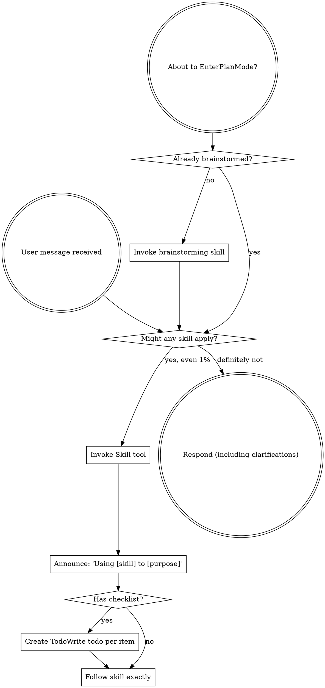

<SUBAGENT-STOP>
If you were dispatched as a subagent to execute a specific task, skip this skill.
</SUBAGENT-STOP>

<EXTREMELY-IMPORTANT>
If you think there is even a 1% chance a skill might apply to what you are doing, you ABSOLUTELY MUST invoke the skill.

IF A SKILL APPLIES TO YOUR TASK, YOU DO NOT HAVE A CHOICE. YOU MUST USE IT.

This is not negotiable. This is not optional. You cannot rationalize your way out of this.
</EXTREMELY-IMPORTANT>

## Instruction Priority

Superpowers skills override default system prompt behavior, but **user instructions always take precedence**:

1. **User's explicit instructions** (CLAUDE.md, GEMINI.md, AGENTS.md, direct requests) — highest priority
2. **Superpowers skills** — override default system behavior where they conflict
3. **Default system prompt** — lowest priority

If CLAUDE.md, GEMINI.md, or AGENTS.md says "don't use TDD" and a skill says "always use TDD," follow the user's instructions. The user is in control.

## How to Access Skills

**In Claude Code:** Use the `Skill` tool. When you invoke a skill, its content is loaded and presented to you—follow it directly. Never use the Read tool on skill files.

**In Copilot CLI:** Use the `skill` tool. Skills are auto-discovered from installed plugins. The `skill` tool works the same as Claude Code's `Skill` tool.

**In Gemini CLI:** Skills activate via the `activate_skill` tool. Gemini loads skill metadata at session start and activates the full content on demand.

**In other environments:** First map the available tool names to the skill functions you need (look for tools whose descriptions mention skills, skill activation, or loading instructions). If no direct skill-loading tool exists, use the harness-provided skill mechanism or the already-injected skill contents. Do not invent tool names. If mapping is ambiguous, state the mapping you will use and proceed with the safest read-only/list operation; ask only if no available tool can load or inspect skills.

## Platform Adaptation

Skills use Claude Code tool names. Non-CC platforms: see `references/copilot-tools.md` (Copilot CLI), `references/codex-tools.md` (Codex), and `references/gemini-tools.md` (Gemini CLI) for tool equivalents. If your harness is not listed, infer equivalents by tool description and schema, prefer read-only/list operations while confirming the mapping, and never skip a skill because the tool name differs.

# Using Skills

## The Rule

**Invoke relevant or requested skills BEFORE any response or action.** Even a 1% chance a skill might apply means that you should invoke the skill to check. This includes greetings, status updates, clarifying questions, plans, file reads, searches, shell commands, and tool calls. If an invoked skill turns out to be wrong for the situation, you don't need to use it.

## Red Flags

These thoughts mean STOP—you're rationalizing:

| Thought | Reality |
|---------|---------|
| "This is just a simple question" | Questions are tasks. Check for skills. |
| "I need more context first" | Skill check comes BEFORE clarifying questions. |
| "Let me explore the codebase first" | Skills tell you HOW to explore. Check first. |
| "I can check git/files quickly" | Files lack conversation context. Check for skills. |
| "Let me gather information first" | Skills tell you HOW to gather information. |
| "This doesn't need a formal skill" | If a skill exists, use it. |
| "I remember this skill" | Skills evolve. Read current version. |
| "This doesn't count as a task" | Action = task. Check for skills. |
| "The skill is overkill" | Simple things become complex. Use it. |
| "I'll just do this one thing first" | Check BEFORE doing anything. |
| "This feels productive" | Undisciplined action wastes time. Skills prevent this. |
| "I know what that means" | Knowing the concept ≠ using the skill. Invoke it. |

## Skill Priority

When multiple skills could apply, use this order:

1. **Process skills first** (brainstorming, debugging) - these determine HOW to approach the task
2. **Implementation skills second** (frontend-design, mcp-builder) - these guide execution

"Let's build X" → brainstorming first, then implementation skills.
"Fix this bug" → debugging first, then domain-specific skills.

## Autonomous Skill Chaining

After any skill finishes a phase, re-check for the next applicable skill before responding. If a process skill produces a plan that implies another workflow, invoke the next skill immediately instead of asking the user whether to continue. Chain skills until no applicable skill remains or you hit a true blocker.

Examples:
- Brainstorming produces implementation work → invoke the appropriate implementation or planning skill.
- A plan is approved or supplied → invoke executing-plans (or the relevant execution skill).
- Code changes complete → invoke requesting-code-review or finishing/validation skills when available.
- A bug investigation identifies a fix → invoke test-driven-development when changing behavior or adding regression coverage.

Do not stop after saying what you would do next when you can safely do it now.

## Workflow Continuity

Continue through required workflow phases automatically: discover → invoke skill(s) → follow checklists → execute actions → validate results → report. Ask the user only for true blockers such as missing credentials, unavailable required inputs, destructive permission, or mutually exclusive requirements that cannot be resolved safely. Preference questions, optional confirmations, and "should I continue?" are not blockers; choose a safe default, state it briefly, and proceed.

If a skill says to announce usage, announce and continue in the same turn. If a skill has a checklist, create tracking items with your harness equivalent and work them to completion without waiting for the user after each item.

## Evidence Before Claims

Before saying work is done, verify the outcome with evidence appropriate to the task: tests, linters, builds, grep/static checks, file diffs, command output, or read-back of changed content. If validation is unavailable or inconclusive, say exactly what could not be run and why; do not claim completion beyond the evidence.

## Unknown Harness Tool Mapping

If the current harness has different tool names than a skill references:

1. Inspect available tools, descriptions, and schemas.
2. Map by capability, not by name (`Read` = read file, `Bash` = shell command, `TodoWrite` = task tracking, `Task` = subagent/delegation, `Skill` = skill activation/loading).
3. Prefer the least-destructive equivalent while validating the mapping.
4. If no equivalent exists, continue with the closest safe workflow and explicitly note the missing capability.
5. Ask the user only when the missing mapping prevents safe progress.

## Skill Types

**Rigid** (TDD, debugging): Follow exactly. Don't adapt away discipline.

**Flexible** (patterns): Adapt principles to context.

The skill itself tells you which.

## User Instructions

Instructions say WHAT, not HOW. "Add X" or "Fix Y" doesn't mean skip workflows.
